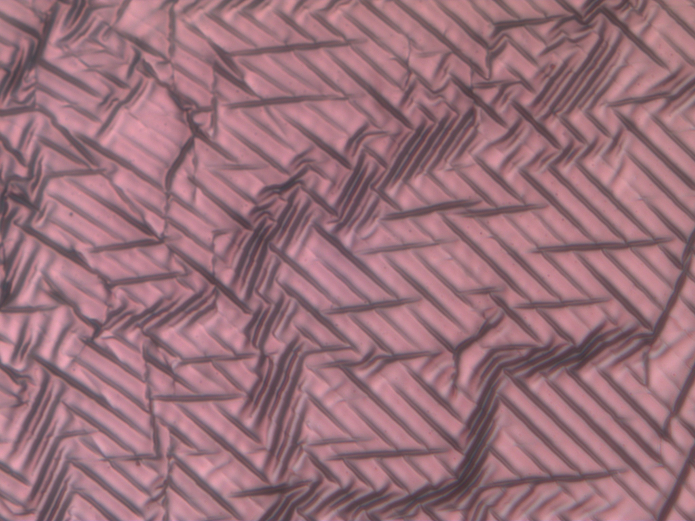
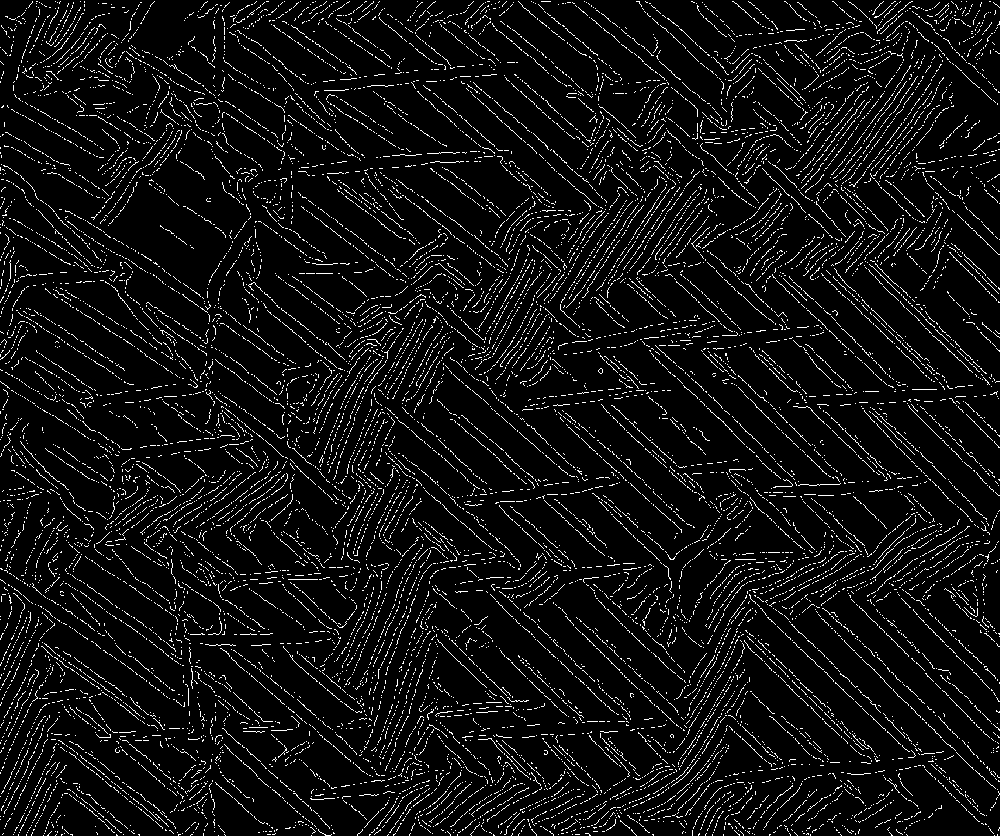
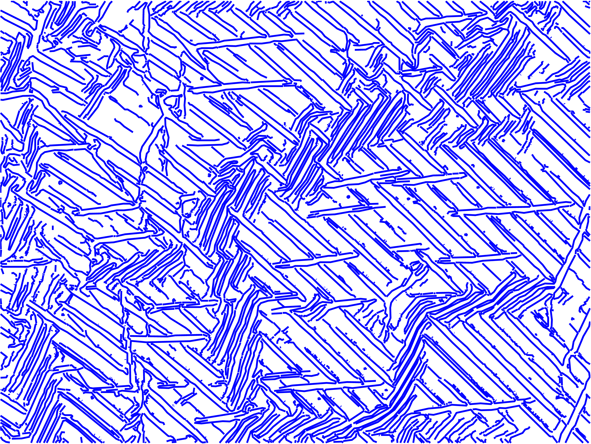
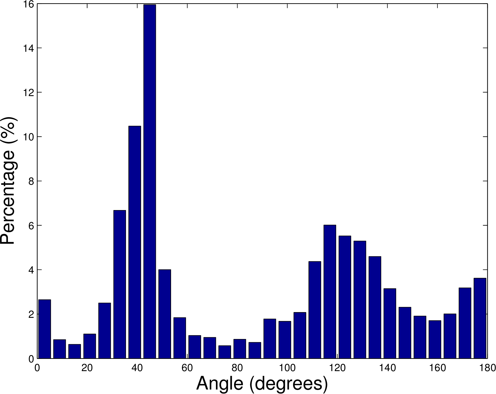
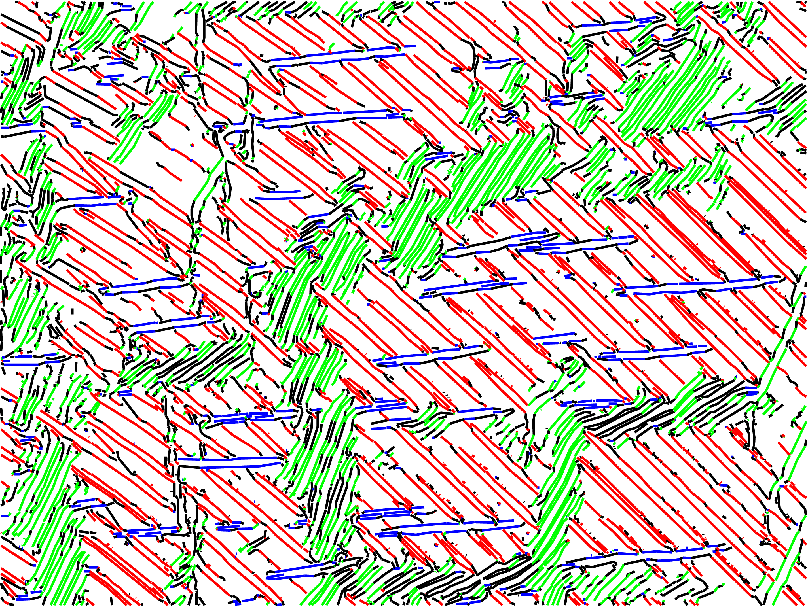
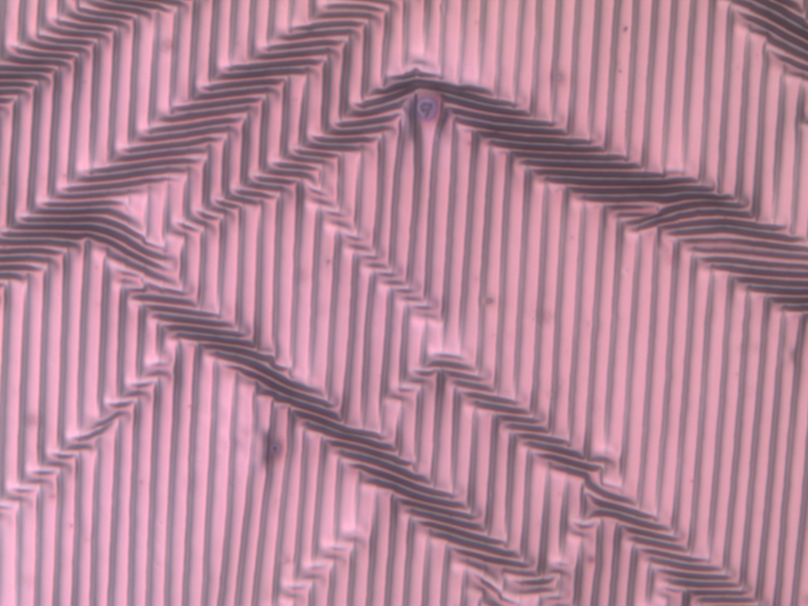
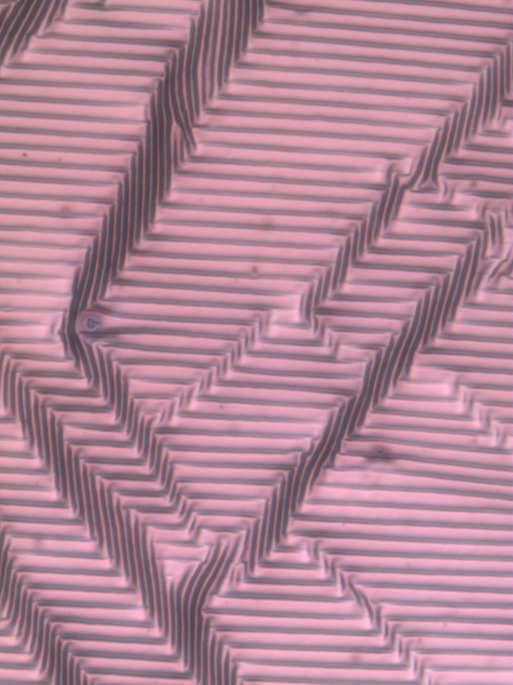

# Analyzing Stroke Orientation in Images

This script is used for determining the dominant orientations of strokes present in an input image. It constructs a histogram showing the amount of strokes in a given orientation. It can also identify if the two input images are taken at different locations on the same sample by comparing their histograms.

## Requirement

* Matlab (tested on R2014a)

## Features
* Detect strokes and fit the strokes with segments.
* Generate a statistic histogram, with percentage of counts as a function of orientation.
* Highlight orientations with different colors on the line segments image.
* Match two images by rotation and output the rotation angle and KL Divergence (the distance between two angular distributions).


## Usage and Examples
###Single image

!!!ADD DESCRIPTIONS!!!

#### Step 0: Prepare an image



#### Step 1: Run `wrinkling_1img.m`


Find edges using the Canny operator



Discard contours less than 10 pixels long, and construct the image with the fitted line segments



Calculate the length and angle of each segment and generate a histogram showing the amount of segments in a given angle. In this example, the histogram shows peaks center at 30°~50°, 110°~140°, and 170°~5°. **Note: the angle is measured clockwise from the horizontal line.



Hightlight edges with particular angles: red: 30°~50° , green: 110°~140°, and blue: 170°~5°




Running `wrinkling_1img.m` without changing parameters yields the default input image and settings. You can change the values for the following parameters:

* `image`: input image file name

* `minlength`:

  The script will discard the contour shorter than the value you set (measured in pixels, default value = 10).

* `tol`:

  adjust `tol` in `stats.m`. `tol` is the maximum deviation from straight line before a segment is broken in two (measured in pixels, default = 2)

* `newthetas = rotate(thetas, rotate_angle)`:

  adjust `rotate_angle` in `wrinkling_1img.m`.  Rotate image by `rotate_angle` degrees in a clockwise direction. `rotate_angle` is set to 0 when not rotating the image

* `[histw, intervals] = histwc(newthetas, lens, nbins, bound)`:

 adjust `nbins` and `bound` in `wrinkling_1img.m`. `nbins` is number of bins, default nbins is 30 when setting nbins 0 or nargin is equal to 2. `bound` is a 2 elements array, specify the lower and upper limits of the bin, default value is [0 180]

* `options.angle_bound = [ang1 ang2; ang3 ang4; ang5 ang6]`:

 adjust `ang` in `wrinkling_1img.m`. specify bounds to highlight from the original histogram (can be as many ranges as needed)

* `options.color = ['color1', 'color2', 'color3']`:

 adjust `color` in `wrinkling_1img.m`. specify color for each highlighted contour set (number of colors should be the same as the number of bounds)


###Two images

#### Step 0: Prepare two images

image1


image2

#### Step 1: Run `wrinkling_2img.m`
Calculate the histogram2 of image2.

Fix image2 as reference and rotate image1 from 0° to 179°.

Calculate the histogram1 of image1 at each rotated angle.

Compute Kullback-Leibler divergence of histogram2 and histogram1 at each rotated angle.

Show the value of **minumum divergence (mindist)** and its corresponding **rotated angle (bestangle)** as output.

In this example, the bestange is 90° and the mindist is 0.0015.

### Output:

```
mindist =

    0.0015


bestangle =

    90
```

## Files
- wrinkling_1img.m
     * stats.m
        * edgelink.m
            * findendsjunctions.m
        * lineseg.m
            * maxlinedev.m
     * rotate.m (optional)
     * histwc.m
     * showhist.m
     * showimage.m
        * drawedgelist.m

- wrinkling_2img.m
     * stats.m
        * edgelink.m
            * findendsjunctions.m
        * lineseg.m
            * maxlinedev.m
     * histwc.m
     * rotate.m
     * KLDiv.m

##Credits

* <http://www.peterkovesi.com/matlabfns/#edgelink>
* Thanks to Yu-Cheng Chen and Han-Yu Hsueh for providing images.
* Specical thanks to Steve Li for his help and constructive discussion.


