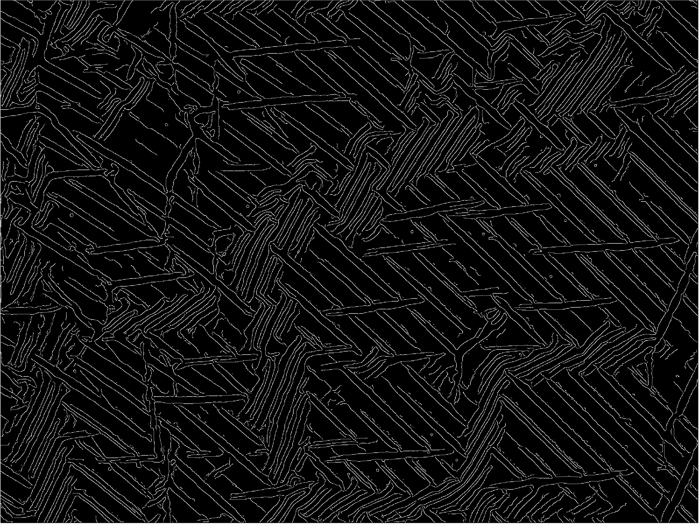

# Analyzing Stroke Orientation in Images

This script is used for determining the dominant orientations of strokes present in an input image. It constructs a histogram showing the amount of strokes in a given orientation. It can also identify if the two input images are taken at different locations on the same sample by comparing the two histograms.

## Requirement

* Matlab (tested on R2014a)

## Features
* Detect strokes and fit the strokes with segments.
* Generate a statistic histogram, with percentage of counts as a function of orientation.
* Highlight orientations with different colors on the line segments image.
* Match two images by rotation and output the rotation angle and KL Divergence (the distance between two angular distributions).


## Usage and Examples
###Single image

First prepare an image 


Then Run `wrinkling_1img.m`. The outlines were detected by the Canny edge detection method 



The script discarded contours less than 10 pixels long, and fitted the contours with discrete line segments. Below shows the image constructed by 
the fitted line segments.


The script then calculated the length and angle of each segment and generate a histogram showing the amount of segments in a given angle. In this example, the strokes exist in 3 populations: one with an orientation at about 45°, one at about 120°, and the other one at around 0°. **Note: the angle is reported clockwise from the horizontal line.


Lastly, an optional image hightlights the strokes with the dominant angles in different colors: red: 30°~50° , green: 110°~140°, and blue: 170°~5°


Running `wrinkling_1img.m` without changing parameters yields the default input image and settings. You can change the values for the following parameters:

* `-image`: Input image file name

* `-minlength`: Minimum edge length of interest (measured in pixels). Default is 10.

* `tol`: Maximum deviation from straight line before a segment is broken in two (measured in pixels). Default is 2.

* `-rotate_angle`: Angle of rotation in a clockwise direction. Defalt is 0°.

* `-nbins`: Number of intervals. Default nbins is 30 when setting nbins 0 or nargin is equal to 2. 
 
* `-bound`: A 2 elements array. Specify the lower and upper limits of the bin. Default value is [0 180]

* `-options.angle_bound`: Populations of dominant orientation to highlight from the original histogram, can be as many ranges as needed.

* `-options.color`: Colors highlighted for each population. The number of colors should be the same as the number of bounds.


###Two images

First prepare two images which you are interested in studying the difference in orientaton distribution.


Run `wrinkling_2img.m`. The script will execute in the following order:

1. Calculate the histogram2 of image2.

2. Fix image2 as reference and rotate image1 from 0° to 179°.

3. Calculate the histogram1 of image1 at each rotated angle.

4. Compute Kullback-Leibler divergence of histogram2 and histogram1 at each rotated angle.

5. Show the value of **minumum KL Divergence (mindist)** and its corresponding **rotated angle (bestangle)** as output.

### Output:

```
The minimum KL Divergence is 0.001472
The alignment angle is 90 degrees
```

## Files
- wrinkling_1img.m
     * stats.m
        * edgelink.m
            * findendsjunctions.m
        * lineseg.m
            * maxlinedev.m
     * rotate.m (optional)
     * histwc.m
     * showhist.m
     * showimage.m
        * drawedgelist.m

- wrinkling_2img.m
     * stats.m
        * edgelink.m
            * findendsjunctions.m
        * lineseg.m
            * maxlinedev.m
     * histwc.m
     * rotate.m
     * KLDiv.m

##Credits

* <http://www.peterkovesi.com/matlabfns/#edgelink>
* Thanks to Yu-Cheng Chen and Han-Yu Hsueh for providing images.
* Specical thanks to Steve Li for his help and constructive discussion.


